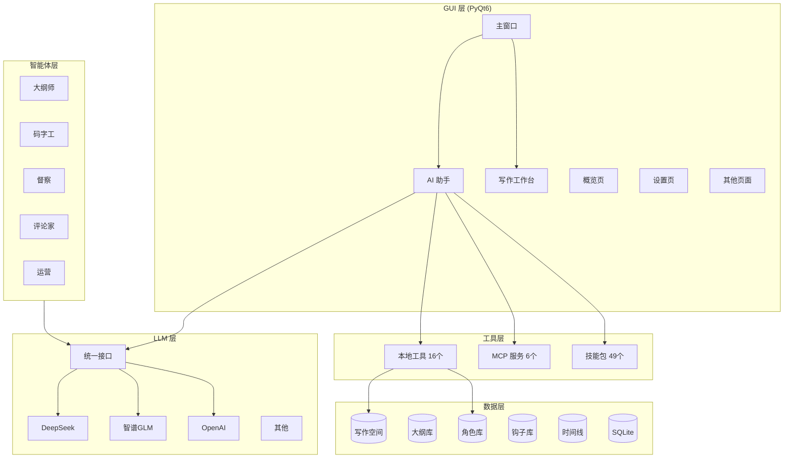

# AI写作助手 - 专业版

> 小说写作领域的 Claude Code —— 基于多智能体协作的AI网文写作辅助系统


**一句话定位**：如果你用 Claude Code 写代码，那这个工具就是用来写小说的。其实本质是obsdian上面加了一个AI管理，算是重复造轮子，如果给代码开发者其实是不如直接在obsdian+claude code+LLM wiki的，不够如果你不懂代码，这个轻量级的编辑器或许可以帮到你。

---

## 它能做什么？

### 核心功能

| 功能 | 说明 |
|------|------|
| AI 对话助手 | ChatGPT 风格界面，@ 引用文件，/ 调用技能，+ 选择专家 |
| 写作工作台 | Obsidian 式文件树，Markdown 编辑器，创作助手 6 卡片 |
| 12 位智能体 | 大纲师、码字工、督察、评论家、运营、读者模拟等 |
| 记忆系统 | 角色状态、钩子追踪、大事记、实体词典、心理维度 |
| 工具调用 | 16 个本地工具 + 6 个 MCP 服务（100 工具） |
| 时间分支 | 剧情走向任意打分支点，写错一键回退 |
| 大纲库 | 46 部历史作品，8 分类，可增删改查 |
| 多格式导出 | TXT、Markdown、Word |
| 邮箱投递 | 一键投递到编辑邮箱 |

### 和其他工具的区别

| 对比项 | Word/WPS | 在线 AI 写作 | **本项目** |
|--------|----------|-------------|-----------|
| 部署方式 | 本地 | 云端 | **本地** |
| 数据安全 | 本地 | 上传云端 | **本地** |
| AI 能力 | 无 | 单一对话 | **12 智能体协作** |
| 记忆系统 | 无 | 无 | **7 模块记忆** |
| 工具扩展 | 无 | 有限 | **MCP + Skills** |
| 网文适配 | 无 | 通用 | **专为网文设计** |

---

## 快速开始

### 环境要求

- Python 3.11+
- Conda（推荐）

### 安装

```bash
# 克隆仓库
git clone https://github.com/Aurirlk/AI_novelsTool_obsdian.git
cd AI_novelsTool_obsdian

# 创建环境
conda create -n novel python=3.11 -y
conda activate novel

# 安装依赖
pip install -r requirements.txt
```

### 启动

```bash
# 桌面应用（推荐）
python src/run_complete.py
```

首次启动后，进入 **设置 → LLM**，选择提供商并粘贴你的 API 密钥（自带 API，即存即用）。

支持 9 家提供商：DeepSeek / 智谱 GLM / OpenAI / 通义千问 / Kimi / 百川 / 星火 / Ollama / 自定义接口。

---

## 界面预览

>

| 页面 | 说明 |
|------|------|
| 概览页 | 功能入口 + 快速开始引导 |
| AI 助手 | ChatGPT 风格对话，支持 @ 引用 / 技能 / 专家 |
| 写作工作台 | 文件树 + Markdown 编辑器 + 创作助手 |
| 设置页 | LLM 配置 + 个性化 + 数据管理 |

---

## 架构设计



---

## 项目结构

```
AI_novelsTool_obsdian/
├── src/
│   ├── core/               # 核心基础设施
│   │   ├── vector_store.py     # 向量存储（ChromaDB）
│   │   ├── cache_manager.py    # 缓存系统
│   │   └── stream_handler.py   # 流式输出
│   ├── agents/             # 智能体（12个）
│   │   ├── outline_agent.py    # 大纲师
│   │   ├── writer_agent.py     # 码字工
│   │   └── reviewer_agent.py   # 督察
│   ├── memory/             # 记忆系统
│   │   ├── memory_manager.py   # 核心记忆管理
│   │   └── shared_memory.py    # 共享记忆
│   ├── data/               # 数据管理
│   │   ├── writing_space.py    # 写作空间
│   │   ├── character_store.py  # 角色存储
│   │   └── hook_store.py       # 钩子存储
│   ├── tools/              # 本地工具
│   │   └── project_tools.py    # 项目数据工具
│   ├── gui/                # 界面（PyQt6）
│   │   ├── professional_main_window.py
│   │   ├── professional_theme.py
│   │   └── pages/              # 15 个功能页面
│   ├── mcp/                # MCP 客户端
│   ├── skills/             # Skills 加载
│   ├── utils/              # 工具
│   │   ├── llm.py              # LLM 客户端
│   │   └── exporter.py         # 导出
│   └── run_complete.py     # 桌面应用入口
├── assets/icons/           # Feather SVG 图标
├── skills/                 # 技能库（49个）
├── config/                 # 全局配置
├── docs/                   # 文档
└── requirements.txt
```

---

## 技术栈

| 组件 | 技术 | 说明 |
|------|------|------|
| UI | PyQt6 | 桌面应用 |
| LLM | OpenAI SDK | 统一接口，支持 9 家提供商 |
| 向量库 | ChromaDB | 语义检索（RAG） |
| 数据库 | SQLite | 设置/密钥/历史 |
| 工具 | MCP 协议 | 扩展工具系统 |
| 智能体 | LangGraph | 多智能体协作 |

---

## 扩展性

### Skills 系统

```bash
# 安装技能
skills install <github-repo-path>

# 查看已安装技能
skills list
```

### MCP 服务器

在 `mcp_servers.json` 中配置：

```json
{
  "servers": [
    {
      "name": "novel-writer",
      "command": "python",
      "args": ["tools/novel-writer/server.py"]
    }
  ]
}
```

---

## 为什么做这个项目？

写网文三年，踩过的坑：

1. **伏笔忘了收**：写了 50 章，前面埋的线断了
2. **人设崩了**：角色性格前后不一致，读者喷了
3. **AI 味太重**：用 ChatGPT 写的段落，一眼假
4. **工具割裂**：Word 写正文、Excel 管角色、便签记伏笔

所以我做了这个工具：**让 AI 当陪练，不当代笔**。

---

## 许可证

MIT License

---

## 致谢

- [Feather Icons](https://feathericons.com/) - 图标库
- [PyQt6](https://www.riverbankcomputing.com/software/pyqt/) - UI 框架
- [ChromaDB](https://www.trychroma.com/) - 向量数据库
- [OpenAI Python SDK](https://github.com/openai/openai-python) - LLM 接口
