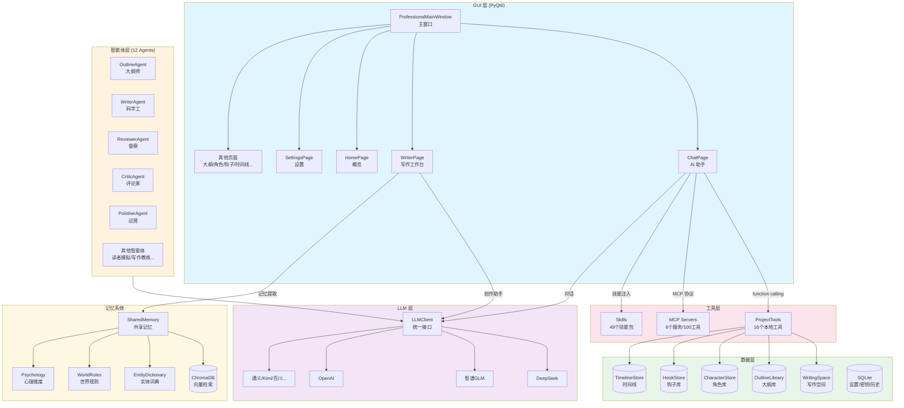

```mermaid
graph TB
    subgraph GUI["GUI 层 (PyQt6)"]
        MW[ProfessionalMainWindow<br/>主窗口]
        CP[ChatPage<br/>AI 助手]
        WP[WriterPage<br/>写作工作台]
        HP[HomePage<br/>概览]
        SP[SettingsPage<br/>设置]
        OP[其他页面<br/>大纲/角色/钩子/时间线...]
    end

    subgraph Agents["智能体层 (12 Agents)"]
        OA[OutlineAgent<br/>大纲师]
        WA[WriterAgent<br/>码字工]
        RA[ReviewerAgent<br/>督察]
        CA[CriticAgent<br/>评论家]
        PA[PolisherAgent<br/>运营]
        MA[其他智能体<br/>读者模拟/写作教练...]
    end

    subgraph Data["数据层"]
        WS[(WritingSpace<br/>写作空间)]
        OL[(OutlineLibrary<br/>大纲库)]
        CS[(CharacterStore<br/>角色库)]
        HS[(HookStore<br/>钩子库)]
        TS[(TimelineStore<br/>时间线)]
        DB[(SQLite<br/>设置/密钥/历史)]
    end

    subgraph Tools["工具层"]
        PT[ProjectTools<br/>16个本地工具]
        MCP[MCP Servers<br/>6个服务/100工具]
        SK[Skills<br/>49个技能包]
    end

    subgraph LLM["LLM 层"]
        LC[LLMClient<br/>统一接口]
        P1[DeepSeek]
        P2[智谱GLM]
        P3[OpenAI]
        P4[通义/Kimi/百川...]
    end

    subgraph Memory["记忆系统"]
        SM[SharedMemory<br/>共享记忆]
        ED[EntityDictionary<br/>实体词典]
        WR[WorldRules<br/>世界规则]
        PS[Psychology<br/>心理维度]
        RAG[(ChromaDB<br/>向量检索)]
    end

    MW --> CP
    MW --> WP
    MW --> HP
    MW --> SP
    MW --> OP

    CP -->|function calling| PT
    CP -->|MCP 协议| MCP
    CP -->|技能注入| SK
    CP -->|对话| LC

    WP -->|创作助手| LC
    WP -->|记忆提取| SM

    PT --> WS
    PT --> OL
    PT --> CS
    PT --> HS
    PT --> TS

    Agents --> LC
    LC --> P1
    LC --> P2
    LC --> P3
    LC --> P4

    SM --> RAG
    SM --> ED
    SM --> WR
    SM --> PS

    style GUI fill:#e1f5fe
    style Agents fill:#fff3e0
    style Data fill:#e8f5e9
    style Tools fill:#fce4ec
    style LLM fill:#f3e5f5
    style Memory fill:#fff8e1
```
