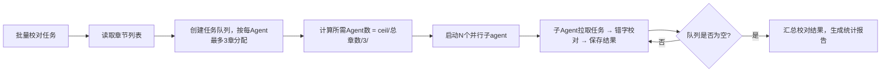

## 网文错字校对

### 触发关键词
帮我校对错字、检查错别字、错字修改、检查笔误、人名不一致、字词校对、校对这个章节、帮我检查错字、校对小说、错字检查、人名写错了、名字前后不一致

### 核心原则（不可违反）
1. **只修错，不改文**：仅修正错别字、误用字词、人名/地名/称谓前后不一致、明显笔误
2. **严禁润色**：禁止任何改写、扩写、缩句、精炼、优化表达、调整节奏、强化爽点、美化文笔的行为
3. **逐字保留**：除修正处外，原文逐字保留，不增删改任何字符
4. **输出修改说明**：每处修改必须说明「原文 → 修改 → 原因」

### 校对类型

#### 1. 错别字与形近字
- 常见混淆：戴着/带着、拼劲全力/拼尽全力、厉害/历害、迫不及待/迫不急待、按捺/按耐、好像/好象
- 形近字误用：己/已/巳、戊/戌/戍、赢/羸/嬴

#### 2. 同音字误用
- 在/再、的/地/得、做/作、像/向/象、他/她/它（指代对象明确时）

#### 3. 人名、地名、称谓一致性
- 同一角色前后写法不同（如「林动」「林东」混用）
- 角色外号/本名/道号混用未统一
- 地名、势力名、功法名、物品名前后写法不一致
- 称谓前后矛盾（如「师父」「师傅」混用未区分）

#### 4. 明显笔误
- 漏字、多字、字序颠倒
- 明显打错的字（如「我来到到青云宗」重复字）

### 校对流程

1. **读取章节**：从 `chapters/` 目录读取待校对章节
2. **全文扫描**：逐字检查上述四类问题
3. **生成修改清单**：每处包含（位置、原文、修改后、原因），存 `.sumeru/polish/diff/`
4. **应用修改**：修改前自动备份原文到 `.sumeru/write/original/`，再写回 `chapters/`
5. **输出校对报告**：修改总数、按类型分布、字数变化、修改明细

### 输出内容
- 校对后的完整章节内容（直接替换 `chapters/` 中的原文件）
- 校对修改说明：调整的地方与原因（按类型分类）
- 校对报告：修改数量、类型分布、遗漏提示（如"该章无错别字"）

### 子Agent并行校对机制

当需要校对的章节数量大于3章时，自动启用子Agent并行校对模式：

**⚠️ 遵循全局约束：每个子Agent最多负责3个章节**（详见 AGENTS.md "子Agent并行处理规则"）
- 所需Agent数 = ceil(总章节数 / 3)
- 相邻章节分配给同一Agent，保持校对口径统一

**调度逻辑**

**子Agent输入上下文**
每个子agent接收：
1. 负责章节的原始内容
2. 该书角色名/地名/势力名单（用于一致性校验）
3. 审查问题清单（如有，重点关注其中的人名/字词类问题）

**章节分配规则**
- 按章节顺序连续分配（如Agent1负责第1-3章，Agent2负责第4-6章）
- 尾部不足3章的Agent按实际剩余章节数分配

**进度追踪**
- 每个Agent完成校对后立即将结果直接保存到 `chapters/`（修改前自动备份到 `.sumeru/write/original/`）
- 实时显示已完成/进行中/待校对章节状态
- 所有Agent完成后，校对结果已直接应用到 `chapters/` 目录

### 数据持久化
校对过程数据自动保存到 `.sumeru/polish/` 目录：
- `diff/`：修改对比文件，记录每处修改的位置、原文、修改后内容、修改原因
- `summary.json`：校对统计报告，包含修改数量、错误类型分布、字数变化
- `config.json`：本次校对的配置参数

#### 与其他 Skill 配合
- **前置 Skill**：读取 `sumeru-write` 和 `sumeru-review` 的输出
  - 从 `chapters/` 读取原始章节内容
  - 从 `.sumeru/review/issues.json` 读取审查问题作为校对重点（仅限字词/人名类问题）
- **后续 Skill**：校对后的内容供 `sumeru-finalize` 使用
  - 校对结果直接保存在 `chapters/` 目录，无需额外应用步骤
  - worldbuilder 编排 polish 时，校对结果自动生效

#### 数据复用
- 支持多轮校对，可基于上一轮校对结果继续检查
- 可导出diff文件用于人工审核修改内容
- 校对口径可复用，保持全本一致性
